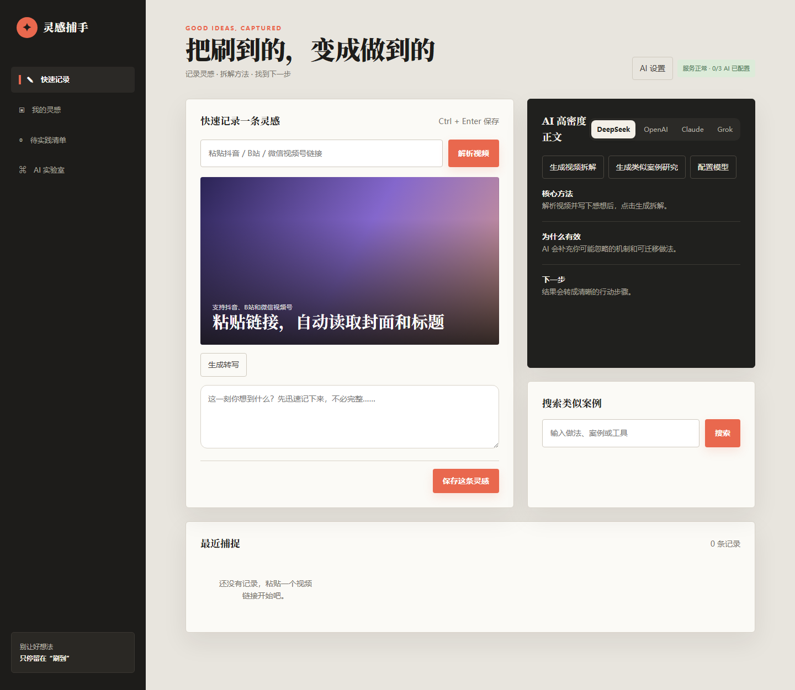
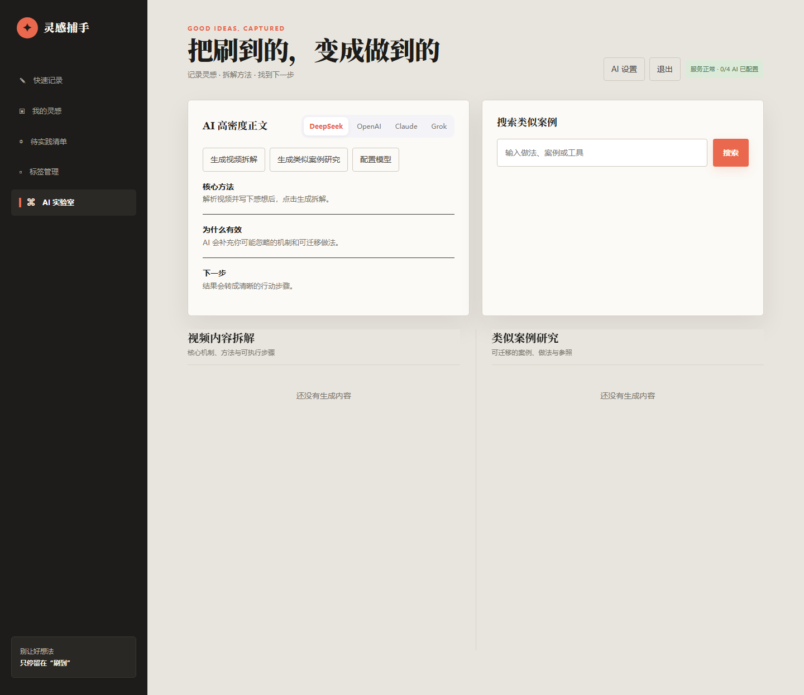
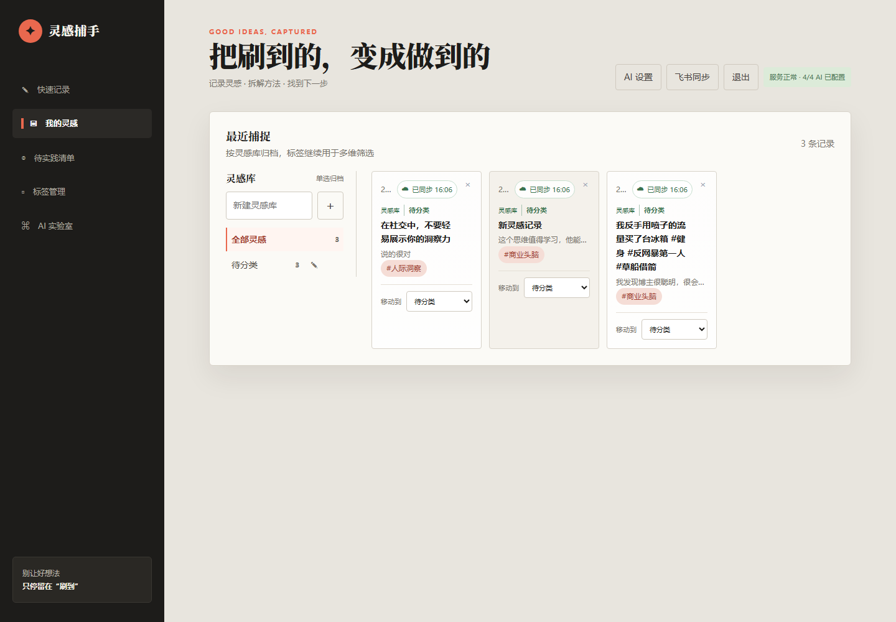
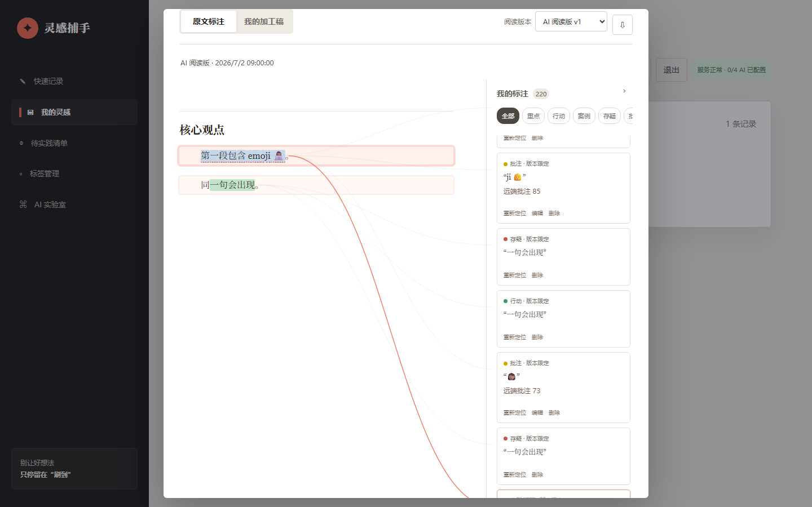
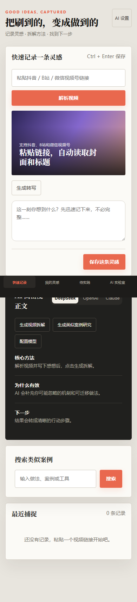

# 灵感捕手

[](https://github.com/15236702150master/inspiration-catcher/actions/workflows/pages.yml)

把刷到的内容变成可执行的下一步：保存视频或文章，补上一句自己的想法，
再用转写、AI 拆解、相似案例和标签把灵感整理成可回看的资料。

<p align="center">
  <a href="https://15236702150master.github.io/inspiration-catcher/">打开静态体验页</a>
  ·
  <a href="#本地运行">本地运行</a>
  ·
  <a href="#项目结构">项目结构</a>
</p>

> GitHub Pages 发布的是不需要后端的静态体验页。完整的登录、SQLite 持久化、
> 转写、AI 调用和飞书同步需要在自己的 Node.js 服务上运行。

## 功能地图

| 阶段 | 入口与处理 | 产出 |
| --- | --- | --- |
| 捕捉 | 抖音、B 站、微信视频号、公众号文章，以及 Word/PDF | 标题、封面、来源和原文 |
| 加工 | Whisper 异步转写、阅读高亮/批注、模型拆解 | 转写稿、阅读版、个人加工稿和案例研究 |
| 归档 | 灵感库、标签、搜索和飞书 OAuth | 可回看的主题资料与同步状态 |

Pages 上的体验台是可重复操作的静态样例：可以解析示例链接、填写感想、在“我的灵感”和“AI 实验室”之间切换，并查看拆解结果。示例状态只保存在浏览器内存，刷新页面会重置；要使用真实数据，请按下面的 Node.js 部署说明运行完整服务。

## 界面一览

### 快速记录与 AI 加工



### AI 实验室



### 灵感库与阅读标注



### 视频、文章和文件入口



移动端界面：



## 能做什么

- 识别抖音、B 站、微信视频号和微信公众号文章链接，并保存标题、封面与来源。
- 支持 Word/PDF 导入，进入同一套阅读、标注和个人加工工作区。
- 通过外部 Whisper worker 异步转写视频，显示任务进度并保留可恢复状态。
- 在 DeepSeek、OpenAI、Claude、Grok 或兼容接口之间切换，生成视频拆解和类似案例研究。
- 用标签和灵感库组织内容；笔记、转写、AI 正文与标注都能在详情页继续编辑。
- 通过飞书 OAuth 进行异步归档；飞书凭据只保存在服务端环境和加密存储中。

## 本地运行

需要 Node.js 22+ 和 npm。

```powershell
npm ci
Copy-Item .env.example .env
# 按需填写 .env 中的模型、转写和飞书配置
npm run dev
```

打开 `http://127.0.0.1:5173`（开发前端）或 `http://127.0.0.1:4173`（Node 服务）。

生产式本地启动：

```powershell
npm ci --omit=dev
npm run build
npm start
```

没有配置模型 API Key 时，记录、阅读和本地数据管理仍可用于验证页面流程；
转写和 AI 操作会显示配置状态。

## 配置要点

从 `.env.example` 复制配置，至少按实际部署填写：

- `ADMIN_TOKEN`、`WORKER_TOKEN`：管理接口和转写 worker 的独立随机值。
- `WECHAT_RESOLVER_URL`：微信视频号解析服务地址；默认值仅用于兼容现有部署，可替换为自己的解析服务。
- `DEEPSEEK_*`、`OPENAI_*`、`ANTHROPIC_*`、`XAI_*`：需要使用的模型接口。
- `PUBLIC_BASE_URL`、`FEISHU_REDIRECT_URI`、`INTEGRATION_ENCRYPTION_KEY`：飞书同步。
- `TRANSCRIBE_COMMAND`：可选的异步转写任务包装命令。

`.env`、数据库、封面、原始记录、日志和临时文件都被 `.gitignore` 排除；
请不要把真实凭据写进源代码、Issue 或截图。

使用微信视频号解析时，分享链接会发送到 `WECHAT_RESOLVER_URL` 指定的服务；生产部署前请确认该服务的隐私策略，或替换为自己维护的解析端点。

## 项目结构

| 路径 | 内容 |
| --- | --- |
| `server.mjs` | Node.js HTTP/API 服务与任务调度 |
| `app.js`、`index.html` | 完整应用入口 |
| `src/` | 转写阅读工作区与前端交互模块 |
| `lib/` | SQLite、文档解析、校验和飞书集成模块 |
| `tests/` | 单元、API、迁移和工作区回归测试 |
| `site/` | GitHub Pages 静态体验页 |
| `docs/images/` | 去除元数据的项目界面截图 |
| `deploy/` | 通用容器模板，不含真实主机参数 |

## 测试与构建

```powershell
npm test
npm run build
npm audit --omit=dev --audit-level=high
```

Pages 工作流会在 Ubuntu runner 上重新安装依赖、构建应用并发布 `site/` 静态体验页；
它不会读取仓库外的 `.env`，也不会启动 SQLite/API 服务。

## 数据与隐私

本项目面向个人资料整理。运行时数据默认保存在本机 `data/`，媒体文件使用临时目录，
飞书令牌使用 `INTEGRATION_ENCRYPTION_KEY` 加密。部署到公网前，请在反向代理层启用
HTTPS、登录保护、请求体大小限制和备份策略。

## 许可证

MIT，详见 [LICENSE](LICENSE)。
